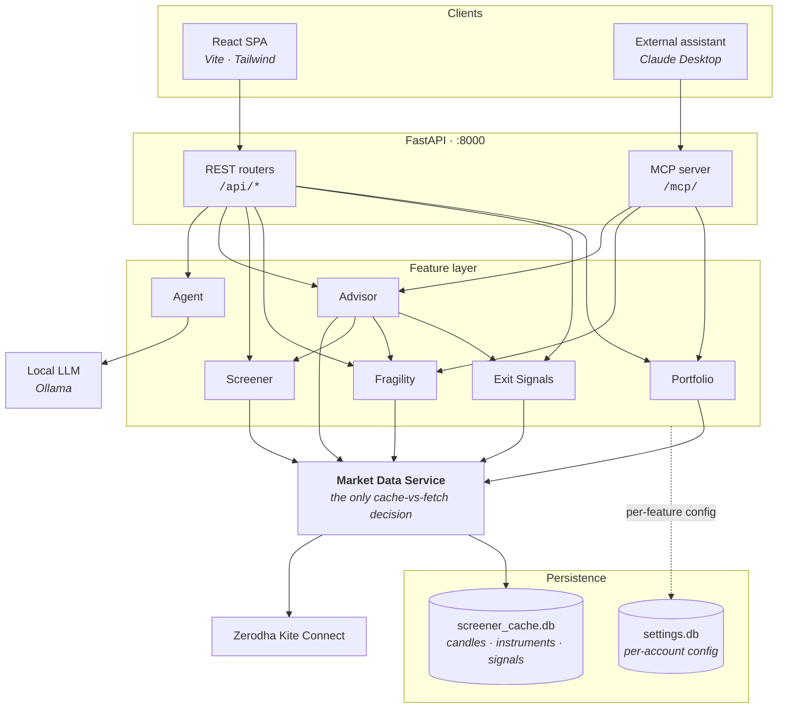
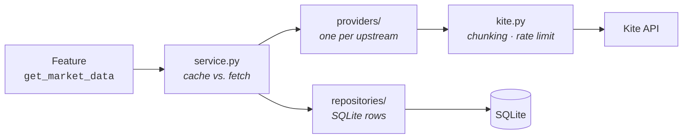

# Portfolio Optimizer

[](https://github.com/swarajxpanda/portfolio-optimizer/actions/workflows/ci.yml)
[](https://www.python.org/downloads/)
[](https://react.dev/)

A full-stack portfolio analytics dashboard for **Zerodha Kite Connect** holdings — turning raw
brokerage data into a structured review workflow: concentration control, diversification analysis,
rule-based exit planning, and multi-strategy screening over the NSE500.

You can also just **ask it questions in plain English**, either from the in-app Agent tab running a
local LLM, or from an external assistant like Claude Desktop over MCP. Both paths are strictly
read-only — nothing here can place, modify, or cancel an order.

---

## What it does

Five analytics areas, each independently useful and all reading from one shared market-data service.

| Area | What you get |
|---|---|
| **Portfolio Overview** | Allocation vs. target bands, group-level P&L, and two concentration caps (top-5, single-holding), each with the rupee amount that would resolve a breach |
| **Exit Signals** | Five KPIs scored per holding, summed to 0–100, mapped to `HOLD` / `WATCH` / `TRIM` / `EXIT`. Weights and thresholds are yours to tune |
| **Fragility & Diversification** | Ledoit-Wolf shrinkage covariance → PCA-based Effective Number of Bets, weight entropy, diversification ratio, annualized portfolio vol, and the correlation matrix with its most-correlated pair. Purely descriptive — it reports structure, it does not prescribe trims |
| **Screener** | Five technical strategies over the NSE500, as a single-strategy leaderboard or a weighted K-of-N combined screen |
| **Advisor** | Combines the three above into ranked sell / top-up / buy calls, each carrying the reasons and numbers behind it. Backs the Agent tab and the MCP tools |

### The numbers behind it

```
portfolio value   = last_price × quantity
invested capital  = average_price × quantity
P&L               = value − invested
return %          = P&L / invested × 100
weight %          = holding value / total portfolio value × 100
```

Risk analytics use **Ledoit-Wolf shrinkage covariance** (a raw sample covariance is too unstable at
portfolio sample sizes), **PCA-based ENB** for how many independent bets you actually hold, and
**Shannon entropy** of weights for nominal spread. The gap between those last two is the interesting
part: it is hidden concentration — positions that look diversified but move together.

---

## Architecture

The load-bearing rule: **every feature reads market data through one service, and nothing else talks
to the broker.** Swapping Kite for another data source is one new provider class, with no feature
touched.



### Why a single data service

Two classes of data, two policies, decided in exactly one place:

- **Historical candles are cache-first.** A settled daily bar never changes, so the store is
  authoritative — only the missing head/tail of a requested window is fetched, then appended.
  This is why screens stay fast and still work on a cold token.
- **Holdings and quotes are live.** They are current account and market state, so they are
  memoised for seconds only — just long enough to collapse repeat calls within one request.

Underneath sit two swappable halves:



Providers self-register and declare a `capabilities` frozenset; asking for an undeclared capability
raises rather than failing obscurely downstream.

### Backend layout

Every feature is layered identically, so knowing one means knowing all five:

```
backend/features/<name>/
  routes.py     FastAPI router — transport only
  service.py    orchestration — the only layer doing I/O
  compute.py    pure computation, no I/O  (or engine.py)
  settings.py   per-feature config via core/settings_store.py
```

```
backend/
  main.py              composition root — mounts 7 routers + the MCP app
  core/
    data/              the market data service (providers · repositories · service)
    kite.py            session lifecycle only — token, not data
    identity.py        the active Zerodha user_id (dependency-free, breaks an import cycle)
    settings_store.py  per-account settings persistence
  features/            portfolio · exit · fragility · screener · advisor · agent · auth · mcp
  tests/               272 tests, no network — a stub provider stands in for the broker
```

### Two design rules worth knowing

**Python ranks, the LLM only narrates.** Every advisor candidate carries
`reasons: [{code, value, ctx, text}]` with `text` pre-written, so no number in an answer ever
originates in the model. That is what makes a 9 GB local model trustworthy here.

**Account isolation.** Settings are keyed per Zerodha `user_id`. `complete_login()` is the single
chokepoint both the REST callback and the MCP login tool pass through, so switching accounts purges
the previous account's cached holdings in exactly one place.

---

## How to run

### Prerequisites

| | Needed for |
|---|---|
| **Docker Desktop** | the backend, containerized — this is the only piece Docker runs |
| **[uv](https://docs.astral.sh/uv/)** | the native backend — installs Python 3.12 for you |
| **Node.js 20.19+ or 22.12+** | the frontend, always run on the host (Vite 8's requirement) |
| **Kite Connect API key** | from [developers.kite.trade](https://developers.kite.trade/) |
| **[Ollama](https://ollama.com)** *(optional)* | the Agent tab |

### 1. Configure

Create `backend/.env`:

```env
KITE_API_KEY=your_api_key
KITE_API_SECRET=your_api_secret
REDIRECT_URL=http://localhost:8000/api/auth/callback
FRONTEND_URL=http://localhost:5173

# Optional — local LLM for the Agent tab (defaults shown, any OpenAI-compatible endpoint works)
LLM_BASE_URL=http://localhost:11434/v1
LLM_API_KEY=ollama
```

### 2. Start the backend — pick one

<details open>
<summary><b>Docker (easiest — no Python on the host)</b></summary>

From the repo root:

```bash
docker compose up --build          # backend at http://localhost:8000
```

```bash
docker compose run --rm backend pytest -q     # tests
docker compose logs -f backend                # follow logs
docker compose down                           # stop
```

The source directory is bind-mounted, so edits hot-reload and both SQLite files stay on the host —
cached candles survive rebuilds and are shared with native runs.

> **Only the backend is containerized.** Compose defines a single service. The frontend still runs
> on the host with `npm run dev`, and **Ollama is not containerized either — Docker will not
> install it or pull a model for you.** Install Ollama on the host and pull the model yourself, as
> in [Ask in plain English](#ask-in-plain-english). Compose points `LLM_BASE_URL` at
> `host.docker.internal` so the container can reach back out to it, since inside a container
> `localhost` means the container. Without Ollama running, the Agent tab returns `llm_unreachable`
> and every other view works normally.

</details>

<details>
<summary><b>Natively with uv</b></summary>

```bash
cd backend
uv sync                              # creates .venv from uv.lock, fetching Python 3.12 if needed
uv run uvicorn main:app --reload     # http://localhost:8000
```

`uv run` re-syncs before every command, so there is no virtualenv to activate. Add or remove
dependencies with `uv add <pkg>` / `uv remove <pkg>` — both update `pyproject.toml` and `uv.lock`.

> **Windows + Smart App Control / WDAC:** the unsigned `uvicorn.exe` shim is blocked (os error
> 4551). Launch it as a module instead — same result:
> `uv run python -m uvicorn main:app --reload`

</details>

> Always run backend commands from `backend/` — the `settings.db` path is relative to the working
> directory.

### 3. Start the frontend

```bash
cd frontend
npm install
npm run dev                          # http://localhost:5173
```

### 4. Use it

Open **http://localhost:5173** and click **Login** — this redirects through Zerodha and back. The
dashboard then loads five views: **Overview · Exit Signals · Fragility · Screener · Agent**.

On first login the screener seeds its price cache in a background thread, so screener results fill
in over the next few minutes while the rest of the app stays usable. Re-trigger it any time with
`POST /api/screener/refresh`.

---

## Development

```bash
# Backend — from backend/
uv run pytest -q          # 272 tests, no network access required
uv run ruff check .       # lint
uv run ruff check . --fix

# Frontend — from frontend/
npm run lint
npm run build
```

CI runs backend (lint + tests) and frontend (lint + build) as independent jobs on every push and
pull request, so one stack's failure never masks the other's.

Tests never reach Kite: `tests/conftest.py` installs the **real** `MarketDataService` — real
cache-vs-fetch logic, real SQLite in a temp dir — behind a `StubProvider`. Configure the stub rather
than patching feature internals.

---

## Screener strategies

Each strategy produces two things per stock from its daily OHLC history: a continuous **`score`**
for ranking, and a boolean **`pass`** used as a hard gate. All parameters are user-configurable;
defaults shown.

| Strategy | What it measures | `score` | `pass` when | Defaults |
|---|---|---|---|---|
| **MA Crossover** | Trend via fast vs. slow moving average | `(SMA_fast − SMA_slow) / SMA_slow` | `SMA_fast > SMA_slow` | fast 20, slow 50 |
| **Momentum 12-1** | Classic 12-month-minus-1-month return | `close₋₂₁ / close₋₂₅₂ − 1` | score > 0 | lookback 252, skip 21 |
| **Breakout** | Close vs. the *prior* N-day high | `close / prior_N_high` | `close > prior_N_high` | n_high 20 |
| **RSI Reversion** | Contrarian — oversold reads as strong | `100 − RSI` (Wilder) | `RSI < oversold` | period 14, oversold 30 |
| **52-Week High** | Proximity to the 1-year high | `close / 252d_high` | `close ≥ proximity × 252d_high` | window 252, proximity 0.90 |

> **Breakout excludes today's own bar** from the window high, which is what makes a new high an
> actual breakout. **RSI Reversion is deliberately contrarian** — it ranks weakness as strength, so
> oversold names float to the top.

**Individual screen** — one strategy, stocks that `pass` it, ranked by raw `score`.

**Combined screen** — several strategies together:

1. **Normalize** each strategy's scores to a cross-sectional percentile in `[0, 1]`, so
   differently-scaled signals become comparable.
2. **Aggregate** as a weighted mean, `Σ(wₛ · normₛ) / Σwₛ` — equal weight if none supplied.
3. **K-of-N gate** — a stock qualifies only if it passes at least **K** of the **N** selected
   strategies. `K = "all"` is a strict AND.
4. **Rank, with fallback** — if nothing qualifies, the top-N by aggregate are shown and the result
   is flagged as a fallback, rather than returning an empty screen.

Signals are precomputed into the cache during a refresh, and only for symbols that received a new
daily candle. **The screening endpoints read that cache and never call Kite**, so changing
strategies, weights, or K re-screens instantly.

> The NSE500 universe (`backend/data/nse500.csv`) is a static, manual, roughly quarterly drop-in of
> the official constituents CSV — never fetched or scheduled. A refresh skips and logs any symbol it
> cannot fetch (delisted, removed) rather than aborting the run.

---

## Ask in plain English

Two independent **read-only** interfaces over the same analytics. Neither can place, modify, or
cancel orders.

### Agent tab — in-app, local, free

Runs a local model via Ollama: no API key, no per-message cost, and your holdings never leave your
machine.

```bash
ollama pull gemma4:e4b     # 9.6 GB, laptop/CPU-friendly
ollama list                # confirm it's there
```

Open the **Agent** tab and ask *"What should I sell or top up?"*, *"What can I buy for 10% in 3
months?"*, or *"How did your last calls do?"* — horizons and targets in the question become actual
arguments, so those last two produce genuinely different answers.

To use a larger local model or a cloud endpoint, set `LLM_BASE_URL` / `LLM_API_KEY` and pick the
model in settings — no code change. Detail: [`backend/features/agent/README.md`](backend/features/agent/README.md).

### MCP server — external assistants

The same tools are exposed at `http://localhost:8000/mcp/` over the Model Context Protocol, driven
by whatever assistant you already pay for. Add to `claude_desktop_config.json`:

```json
{
  "mcpServers": {
    "kite-portfolio": {
      "command": "uvx",
      "args": ["fastmcp-remote", "http://localhost:8000/mcp/"]
    }
  }
}
```

Tools: `portfolio_holdings`, `portfolio_metrics`, `portfolio_actions`, `buy_ideas`,
`advice_history`, `investor_profile`, `quote`, plus session helpers. Detail:
[`backend/features/mcp/README.md`](backend/features/mcp/README.md).

---

## Tech stack

**Backend** — FastAPI · Python 3.12 · pandas · NumPy · SciPy · scikit-learn · SQLite · uv · pytest · ruff
**Frontend** — React 19 · Vite · Tailwind v4 · Recharts · Axios · ESLint (plain JSX, no TypeScript)
**AI** — FastMCP for the read-only MCP server · OpenAI SDK pointed at local Ollama
**Broker** — Zerodha Kite Connect

---

## Disclaimer

This project computes **rule-based technical signals** from your own holdings and cached price
history. It is not investment advice, it does not predict prices, and every output should be
verified before you act on it. The author is not responsible for financial decisions made using it.

## License

No license has been chosen yet, so default copyright applies — all rights reserved. If you intend
this to be reusable, add a `LICENSE` file (MIT is the usual pick for a project like this).
