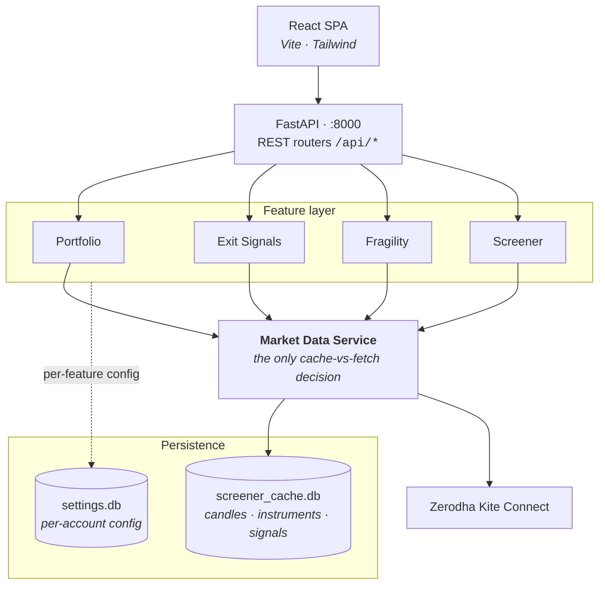
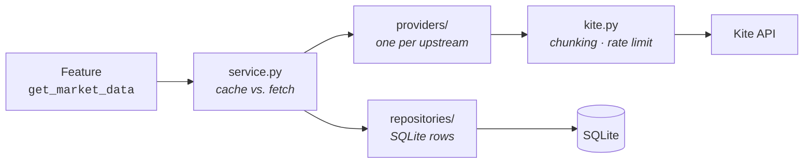

# Portfolio Optimizer

[](https://github.com/swarajxpanda/portfolio-optimizer/actions/workflows/ci.yml)
[](https://www.python.org/downloads/)
[](https://react.dev/)

**A full-stack portfolio analytics dashboard for Zerodha Kite Connect holdings.** It turns raw
brokerage data into a structured review workflow — concentration control, diversification analysis,
rule-based exit planning, and multi-strategy screening over the NSE500.

[**Description**](#description) · [**Architecture**](#architecture) · [**How to run**](#how-to-run)

---

## Description

Four analytics areas. Each is useful on its own, and all four read market data through one shared
service.

| Area | What you get |
|---|---|
| **Portfolio Overview** | Allocation against your target bands, group-level P&L, and two concentration caps (top-5 and single-holding) — each breach reported with the rupee amount that would resolve it |
| **Exit Signals** | Five KPIs scored per holding, summed to 0–100, mapped to `HOLD` / `WATCH` / `TRIM` / `EXIT`. Weights and thresholds are yours to tune |
| **Fragility** | Ledoit-Wolf shrinkage covariance → PCA-based Effective Number of Bets, weight entropy, diversification ratio, annualized volatility, and the most-correlated pair. Purely descriptive: it reports structure, it does not prescribe trims |
| **Screener** | Five technical strategies over the NSE500 — a single-strategy leaderboard, or a weighted K-of-N combined screen |

Position arithmetic is straightforward:

```
value    = last_price × quantity
invested = average_price × quantity
P&L      = value − invested
return % = P&L / invested × 100
weight % = value / total portfolio value × 100
```

The risk analytics are where the real modelling sits. Covariance uses **Ledoit-Wolf shrinkage**,
because a raw sample covariance is too unstable at portfolio sample sizes. **PCA-based ENB** then
says how many genuinely independent bets you hold, and **Shannon entropy** of the weights says how
many you nominally hold. The gap between those two is the interesting number — it is hidden
concentration, positions that look diversified but move together.

Everything is strictly **read-only** — the app can never place, modify, or cancel an order.

---

## Architecture

The load-bearing rule: **every feature reads market data through one service, and nothing else talks
to the broker.** Adding a data source is one new provider class, with no feature touched.



### Why one data service

Two classes of data, two policies, decided in exactly one place:

- **Historical candles are cache-first.** A settled daily bar never changes, so the store is
  authoritative — only the missing head or tail of a requested window is fetched, then appended.
  This is why screens stay fast and keep working on a cold token.
- **Holdings and quotes are live.** They are current account and market state, so they are memoised
  for seconds only, just long enough to collapse repeat calls within one request.

Inside it sit two swappable halves — providers (one per upstream, owning vendor quirks, chunking and
rate limiting) and repositories (SQLite persistence):



Providers self-register and declare a `capabilities` frozenset, so asking for an unsupported
capability raises immediately instead of failing obscurely downstream.

### Code layout

Every feature is layered identically, so knowing one means knowing all four:

```
backend/
  main.py                composition root — mounts the 5 routers, nothing else
  core/
    data/                the market data service (providers · repositories · service)
    kite.py              session lifecycle only — the token, not the data
    identity.py          the active Zerodha user_id (dependency-free, breaks an import cycle)
    settings_store.py    per-account settings persistence
  features/<name>/
    routes.py            FastAPI router — transport only
    service.py           orchestration — the only layer doing I/O
    compute.py           pure computation, no I/O   (or engine.py)
    settings.py          per-feature config
  tests/                 149 tests, no network — a stub provider stands in for the broker
```

### One rule worth knowing

**Account isolation.** Settings are keyed per Zerodha `user_id`, and `complete_login()` is the
single chokepoint every login passes through — so switching accounts purges the previous account's
cached holdings in exactly one place.

---

## How to run

### Prerequisites

| | Needed for |
|---|---|
| **Docker Desktop** | the backend, containerized — this is the only piece Docker runs |
| **[uv](https://docs.astral.sh/uv/)** | the native backend instead — installs Python 3.12 for you |
| **Node.js 20.19+ or 22.12+** | the frontend, always run on the host (Vite 8's requirement) |
| **Kite Connect API key** | from [developers.kite.trade](https://developers.kite.trade/) |

### 1. Configure

Create `backend/.env`:

```env
KITE_API_KEY=your_api_key
KITE_API_SECRET=your_api_secret
REDIRECT_URL=http://localhost:8000/api/auth/callback
FRONTEND_URL=http://localhost:5173
```

### 2. Start the backend — pick one

<details open>
<summary><b>Docker (easiest — no Python on the host)</b></summary>

From the repo root:

```bash
docker compose up --build                     # backend at http://localhost:8000

docker compose run --rm backend pytest -q     # tests
docker compose logs -f backend                # follow logs
docker compose down                           # stop
```

The source directory is bind-mounted, so edits hot-reload and both SQLite files stay on the host —
cached candles survive rebuilds and are shared with native runs.

> **Only the backend is containerized.** Compose defines a single service; the frontend still runs
> on the host with `npm run dev`.

</details>

<details>
<summary><b>Natively with uv</b></summary>

```bash
cd backend
uv sync                              # creates .venv from uv.lock, fetching Python 3.12 if needed
uv run uvicorn main:app --reload     # http://localhost:8000
```

`uv run` re-syncs before every command, so there is no virtualenv to activate. Add or remove
dependencies with `uv add <pkg>` / `uv remove <pkg>` — both update `pyproject.toml` and `uv.lock`.

> **Windows + Smart App Control / WDAC:** the unsigned `uvicorn.exe` shim is blocked (os error
> 4551). Launch it as a module instead — same result:
> `uv run python -m uvicorn main:app --reload`

</details>

> Always run backend commands from `backend/` — the `settings.db` path is relative to the working
> directory.

### 3. Start the frontend

```bash
cd frontend
npm install
npm run dev                          # http://localhost:5173
```

### 4. Use it

Open **http://localhost:5173** and click **Login**, which redirects through Zerodha and back. The
dashboard then loads four views: **Overview · Exit Signals · Fragility · Screener**.

On first login the screener seeds its price cache in a background thread, so those results fill in
over the next few minutes while the rest of the app stays usable. Re-trigger it any time with
`POST /api/screener/refresh`.

### Development

```bash
# Backend — from backend/          # Frontend — from frontend/
uv run pytest -q                    npm run lint
uv run ruff check .                 npm run build
```

CI runs backend (lint + tests) and frontend (lint + build) as independent jobs on every push and
pull request, so one stack's failure never masks the other's.

Tests never reach Kite: `tests/conftest.py` installs the **real** `MarketDataService` — real
cache-vs-fetch logic, real SQLite in a temp dir — behind a `StubProvider`. Configure the stub rather
than patching feature internals.
